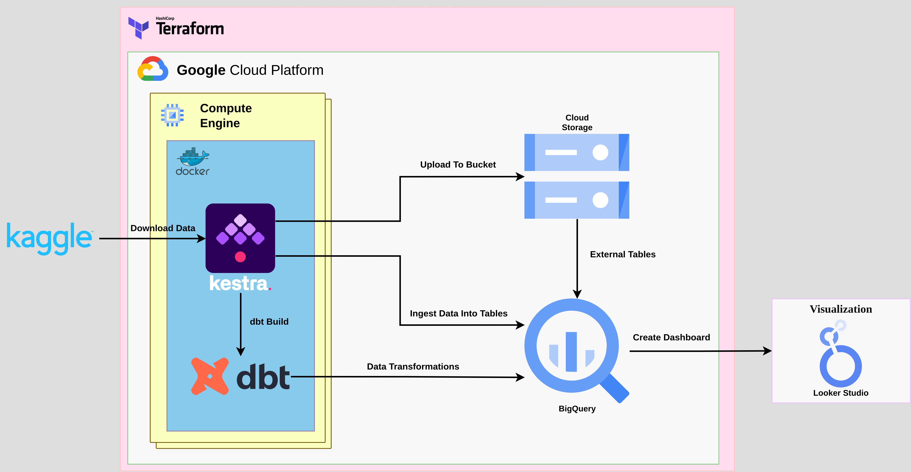
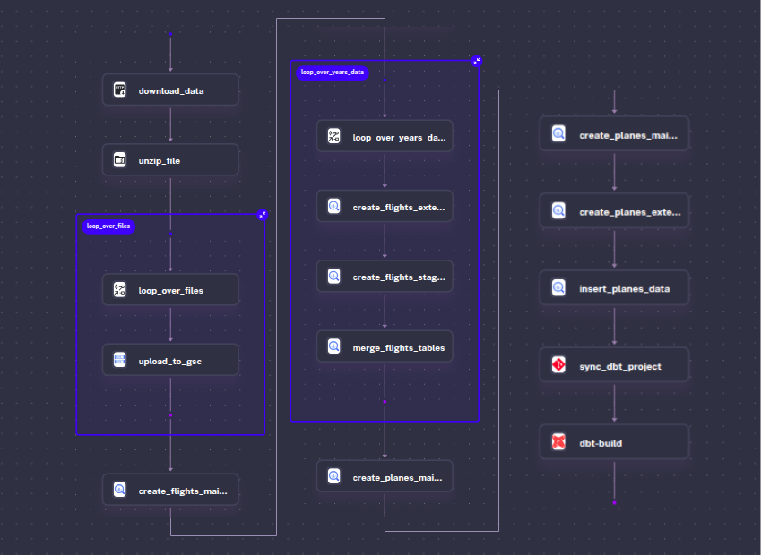
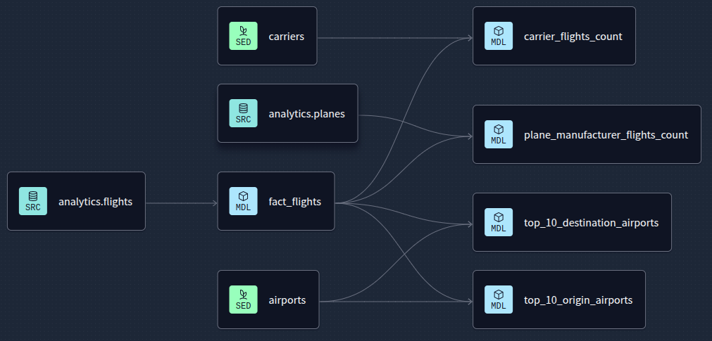
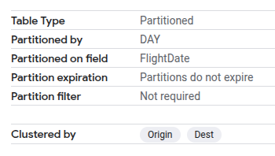
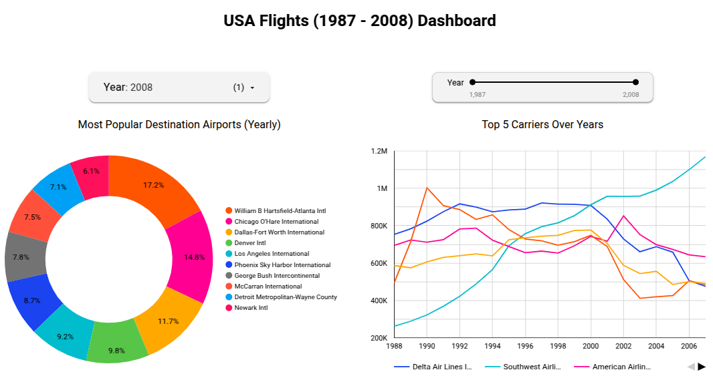

# USA Flights Pipeline

## Project Overview
USA Flights is a cloud-native data pipeline that processes and analyzes historical airline performance data from the [2009 ASA Data Expo](https://www.kaggle.com/datasets/wenxingdi/data-expo-2009-airline-on-time-data/). The pipeline automates the ingestion, cleaning, transformation, and storage of raw flight data into an optimized analytics-ready format. This solution powers an interactive dashboard for visualizing flight data between (1987-2008).

## Problem Description
### The Challenge
Airline on-time performance data is notoriously complex and voluminous. The 2009 ASA Data Expo dataset (120 million flight records) presented two key problems:

- **Manual Processing Burden:** Raw CSV/ZIP files required tedious cleaning before analysis.

- **Unstructured Storage:** Data lived in fragmented files without query optimization.

### How This Project Solved It
A fully automated cloud pipeline was built to transform raw data into actionable insights:

- Automated Ingestion

    - Tool: Kestra + Terraform

    - Terraform auto-provisioned GCP resources (GCS buckets, BigQuery datasets).

    - Kestra automate the whole process of the pipeline

- Scalable Processing

    - Tool: dbt

    - dbt models standardized data and transformed it into ready to analyze data

- Optimized Analytics

    - Tool: BigQuery + Looker Studio

    - Partitioned tables by flight_date improved query speed.

    - Looker Studio dashboard provided real-time analysis

- End-to-End Reliability

    - Tool: Kestra + GCP

    - Kestra orchestrates the whole process of the pipeline 

    - GCP’s global infrastructure ensured 99.9% pipeline uptime.

## Project Design



### Benefits of This Design

- **End-to-End Automation**

    Seamless Flow: Raw data → processing → dashboard with minimal manual steps.

    Terraform: Infrastructure-as-Code (IaC) ensures reproducible, version-controlled deployments.

- **Workflow Orchestration**

    Kestra orchestrates end-to-end workflows

- **Optimized Data Warehouse**

    Using BigQuery to partition and cluster the data enhances the query performance

- **Modern Data Stack Integration (Transformations with dbt)**

    dbt: SQL-based transformations ensure maintainability and testing.

- **Modularity**

    Clear separation of stages (ingestion → transformation → consumption).

    Swap components easily (e.g., replace Looker with Tableau).

- **Actionable Insights**

    Looker Studio: Interactive dashboards for real-time decision-making.

    Pre-aggregated Tables: Faster visualization performance.


## Prerequisites

This project was designed to minimize the need of any extra configuration required to be built by anyone who wants to try it out. Terraform will run everything except for the visualization part of the project

Things you need to run the pipeline:

```
- Terraform
- Google Cloud Platform account (With Service Account having the required permissions)
```

Required permissions for the service account to run the pipeline without any problems:
- BigQuery Admin
- Compute Admin
- Service Account User
- Storage Admin

## Project Structure

The project is organized into two main components:

1. **Terraform**: Contains infrastructure configuration files.
   - `main.tf`: Main Terraform configuration
   - `variables.tf`: Terraform variables
   - `Assets/`: Contains Kestra flow file and the script to run on the compute instance to install Docker and Kestra
   - `Keys/`: You should put your GCP credentials there

2. **dbt_usa_flight**: Contains dbt project files for data transformation.
   - `dbt_project.yml`: Main dbt configuration
   - `analysis/`, `macros/`, `models/`, `seeds/`, `tests/`: Standard dbt directories

## How To Run?

- Install Terraform
- Clone the project
- [Generate ssh key](https://git-scm.com/book/en/v2/Git-on-the-Server-Generating-Your-SSH-Public-Key) for your local machine in case you don't have one 
- Put your credentials in `/USA-Flights-Pipeline/Terraform/Keys/gcp_creds.json`
  - **Note That** this path (and all other paths) may vary depending on weather you are working on Linux or Windows machine (review all of the files paths in the variable file in case you are running this project on Windows)
- Open [variables.tf](Terraform/variables.tf) file to complete the required configurations (Project_ID, Region_name, etc)
- You can also configure any of the variables to match your preferences for deploying
- Navigate to "Terraform" directory
    ```bash
    cd Terraform
    ```
- Init Teraform
    ```bash
    terraform init
    ```
- Deploy the project
    ```bash
    terraform apply -auto-approve
    ```

**Note That:** Terraform will create the needed resources (compute,bucket,dataset), move the required files to the compute instance (flow file, project script), and run the script to install Kestra and execute the flow for the pipeline. **Open [run_kestra](Terraform/Assets/run_kestra.sh)** script for a better understanding.

## Kestra For Orchestration
The pipeline uses Kestra for workflow orchestration and automating it from end-to-end.



See **[kestra_flow_file](Terraform/Assets/kestra_flow.yaml)** if you want to know the details of the pipeline

## Transformations Using dbt
This project uses dbt (data build tool) to transform raw airline data into analytics-ready tables in BigQuery.



You can check the full model in **[dbt_flights_project](dbt_usa_flight)**

## BigQuery Performance
In this project the flights table are partitioned by `FlightDate` column and clustered by both the `Origin` and `Dest` columns to match the high performance requirements for real-time analytics.



## Final Result Dashboard in Looker Studio
The final analytics output of this project is delivered through an interactive Looker Studio dashboard using the preprocessed data from dbt models.

Explore the live dashboard here: [USA Flights Dashboard](https://lookerstudio.google.com/s/iAQjghAL288)



## Acknowledgment

### Technologies & Platforms
- **Google Cloud Platform (GCP):** For scalable infrastructure (Compute Engine, BigQuery, Cloud Storage).

- **Terraform:** Enabled Infrastructure-as-Code (IaC) to automate and version-control cloud resources.

- **Docker:** Containerized pipeline components for portability and reproducibility.

- **Kestra:** Orchestrated end-to-end workflows with fault-tolerant task scheduling.

- **dbt (data build tool):** Transformed raw data into analytics-ready models with SQL-based modularity.

- **Looker Studio:** Powered interactive visualizations for actionable insights.

### Data Source
- **Kaggle:** Provided the foundational dataset [2009 ASA Data Expo: Airline On-Time Performance](https://www.kaggle.com/datasets/wenxingdi/data-expo-2009-airline-on-time-data/), enabling analysis of flight delays and cancellations.


Special thanks to [DataTalkClub](https://datatalks.club/) for the Data Engineering Zoomcamp 2025 course, this project was created as a part of this course.

